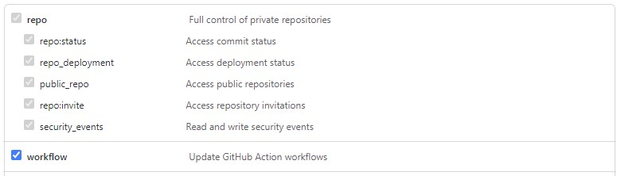
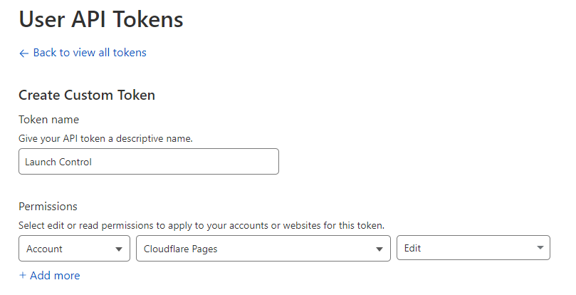

# Launch Control
A tool to help you bootstrap projects
## Installation
```sh
curl https://storage.googleapis.com/launchctl/install.sh | sh -
```
## Usage
### Export Relevant Variables
```sh
export GITHUB_TOKEN=<token>
export DENO_DEPLOY_TOKEN=<token> # Only required for Deno Deploy flavours
export DENO_DEPLOY_TOKEN=<token> # Only required for Cloudflare Pages flavours
export CLOUDFLARE_ACCOUNT_ID=<account_id> # Only required for Cloudflare Pages flavours
```
### Create a GitHub PAT Token
Go to your [https://github.com/settings/tokens](GitHub profile) and create a token with repo and workflow permissions

### Create a Denoy Deploy Token
Go to your [Deno profile](https://dash.deno.com/account#access-tokens) and create an access token
### Create a Cloudflare Pages Token
Go to your [Cloudflare Profile](https://dash.cloudflare.com/profile/api-tokens) and create a token with Cloudflare Pages edit permission

### Run
```sh
launchctl <flavour> <project_name>
e.g. launchctl svelte-astro-deno hello-world
```
## Flavours
### [svelte-cloudflare](https://github.com/fraserdarwent/launchctl-svelte-cloudflare)
SvelteKit on Cloudflare Pages via GitHub Actions
### [svelte-astro-deno](https://github.com/fraserdarwent/launchctl-svelte-astro-deno)
Astro + Svelte on Deno Deploy via GitHub Actions
